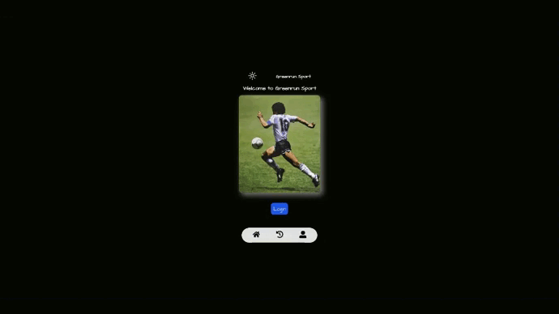

# app-sports

<h1>APP GREENRUN CHALLENGE FRONT END DEVELOPER</h1>

<h4>
  Fork repository and clone locally 
</h4>

  Install the packages
  -----> <strong>npm install</strong>

  Run the project in port 3000
  -----> <strong>npm run dev</strong>

<h4>Technologies</h4>
<ul>
  <li> React </li>
  <li> Typescript </li>
  <li> Firebase auth </li>
  <li> Firebase firestore database</li>
  <li> Axios </li>
  <li> Styled-Components </li>
<ul>